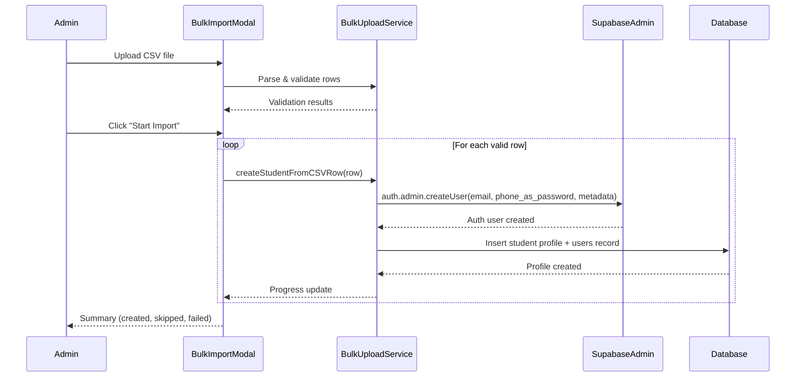
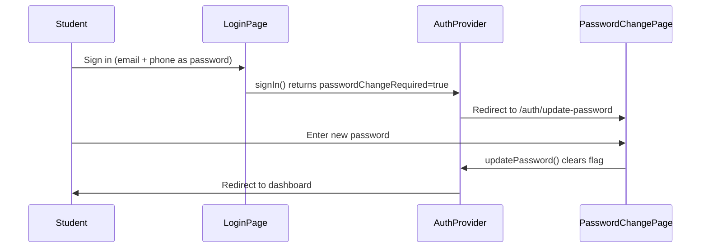

# Design Document: CSV Bulk Student Upload

## Overview

This feature adds a streamlined CSV bulk upload flow to the existing `BulkImportModal`, allowing admins to create student accounts using a simplified 3-column CSV format (Full Name, Mail ID, Phone No). Each student gets a Supabase Auth account with their phone number as a temporary password and a `force_password_change` flag that forces them to set a new password on first login.

The implementation leverages existing infrastructure:
- `BulkImportModal` and `useCSVParser` for file handling
- `supabaseAdmin.auth.admin.createUser()` for account creation
- Existing `signIn()` already returns `passwordChangeRequired`
- Existing `/auth/update-password` route for password changes

## Architecture





## Components and Interfaces

### 1. Bulk Upload Service (`src/services/bulk-upload.service.ts`)

New service file with the core logic:

```typescript
interface CSVStudentRow {
  rowNumber: number;
  fullName: string;
  email: string;
  phone: string;
}

interface BulkUploadValidationResult {
  valid: CSVStudentRow[];
  invalid: { rowNumber: number; error: string }[];
}

interface BulkUploadProgress {
  total: number;
  processed: number;
  created: number;
  skipped: number;
  failed: number;
}

interface BulkUploadResult {
  summary: BulkUploadProgress;
  errors: { rowNumber: number; email: string; error: string }[];
  skipped: { rowNumber: number; email: string; reason: string }[];
}

// Functions:
function validateCSVHeaders(headers: string[]): { valid: boolean; missing: string[] }
function validateCSVRow(row: CSVStudentRow): { valid: boolean; error?: string }
function validateCSVData(rows: CSVStudentRow[]): BulkUploadValidationResult
async function bulkCreateStudents(
  rows: CSVStudentRow[],
  instituteId: string,
  onProgress: (progress: BulkUploadProgress) => void
): Promise<BulkUploadResult>
```

### 2. Force Password Change Guard (`src/components/ForcePasswordChangeGuard.tsx`)

A wrapper component that checks `user_metadata.force_password_change` and redirects:

```typescript
interface ForcePasswordChangeGuardProps {
  children: ReactNode;
}

// Wraps authenticated routes. If force_password_change is true in user metadata,
// redirects to /auth/update-password. The existing update-password page already
// calls updatePassword() which clears the flag.
```

### 3. Updated CSV Parser Hook

The existing `useCSVParser` maps headers like `full_name`, `contact_email`. We'll add support for the simplified CSV format headers: `Full Name`, `Mail ID`, `Phone No`.

### 4. Updated BulkImportModal

The existing modal already handles file upload, preview, and progress. We'll add:
- A "Simple CSV" mode that uses the 3-column format
- Updated template download for the simplified format
- Integration with the new `bulkCreateStudents` service

### 5. Password Validation on Update Page

The existing `/auth/update-password` route needs:
- Validation that new password ≠ temporary password (phone number)
- Minimum 8-character length validation
- Clear the `force_password_change` flag after successful update

## Data Models

### CSV Input Format

| Column | Required | Validation |
|--------|----------|------------|
| Full Name | Yes | Non-empty string |
| Mail ID | Yes | Valid email format (`/^[^\s@]+@[^\s@]+\.[^\s@]+$/`) |
| Phone No | Yes | 6-15 digits (used as temporary password) |

### Supabase Auth User (created per row)

```typescript
{
  email: row.mailId,
  password: row.phoneNo,
  email_confirm: true,
  user_metadata: {
    name: row.fullName,
    role: "student",
    institute_id: instituteId,
    force_password_change: true
  }
}
```

### Student Profile Record (users table)

```typescript
{
  id: authUser.id,        // from Supabase Auth
  name: row.fullName,
  email: row.mailId,
  phone: row.phoneNo,
  role: "student",
  institute_id: instituteId,
  is_active: true
}
```

## Correctness Properties

*A property is a characteristic or behavior that should hold true across all valid executions of a system—essentially, a formal statement about what the system should do. Properties serve as the bridge between human-readable specifications and machine-verifiable correctness guarantees.*

### Property 1: Row validation preserves valid rows

*For any* set of CSV rows where each row has a non-empty full name, a valid email format, and a phone number with 6-15 digits, the validation function SHALL classify all such rows as valid and return them unchanged.

**Validates: Requirements 1.2, 1.3, 1.4**

### Property 2: Invalid rows are always rejected with row numbers

*For any* set of CSV rows containing rows with empty/missing email or invalid email format or empty/missing phone, the validation function SHALL reject exactly those rows and report their original row numbers.

**Validates: Requirements 1.2, 1.3, 1.4**

### Property 3: Summary counts are consistent

*For any* bulk upload result, the sum of created + skipped + failed counts SHALL equal the total processed count.

**Validates: Requirements 2.6**

### Property 4: Duplicate emails are skipped

*For any* set of CSV rows where some emails already exist in the system, the bulk upload SHALL skip those rows, include them in the skipped list, and never attempt to create a duplicate auth account.

**Validates: Requirements 2.5**

### Property 5: Force password change redirect is enforced

*For any* authenticated user whose user_metadata contains `force_password_change: true`, the auth guard SHALL redirect to the password change page regardless of the requested route.

**Validates: Requirements 4.1, 4.2**

### Property 6: New password must differ from temporary password

*For any* password submission where the new password equals the user's phone number (temporary password), the validation SHALL reject the submission.

**Validates: Requirements 4.4**

## Error Handling

| Scenario | Handling |
|----------|----------|
| CSV parse failure (malformed file) | Show papaparse error message, abort import |
| File exceeds 10MB | Reject before parsing, show size limit error |
| Missing required headers | Show which headers are missing |
| Invalid row data | Collect in `invalid` array, show per-row errors |
| Supabase createUser fails (network) | Mark row as failed, continue with next row |
| Duplicate email (user exists) | Mark row as skipped, continue processing |
| All rows invalid | Show "no valid students to import" error |
| Password update fails | Show error on update-password page, allow retry |

Errors during bulk import do NOT stop processing. Each row is processed independently so one failure doesn't block others. The final summary shows all outcomes.

## Testing Strategy

### Unit Tests
- CSV header validation (correct headers pass, missing headers fail)
- Row validation (email format, phone format, empty fields)
- Summary count consistency
- Password validation (length, same-as-phone rejection)

### Property-Based Tests
- **Property 1 & 2**: Generate random CSV rows with varying validity, verify validation function correctly partitions them
- **Property 3**: Generate random processing outcomes, verify count arithmetic
- **Property 4**: Generate row sets with known duplicates, verify skip behavior
- **Property 5**: Generate random user metadata states, verify redirect logic
- **Property 6**: Generate random phone/password pairs, verify rejection when equal

Property-based testing library: Use `fast-check` for TypeScript.
Each property test runs minimum 100 iterations.
Tag format: **Feature: csv-bulk-student-upload, Property {N}: {title}**

### Integration Tests
- Full CSV upload flow with mocked Supabase Admin API
- Force password change redirect after login
- Password update clears the flag
