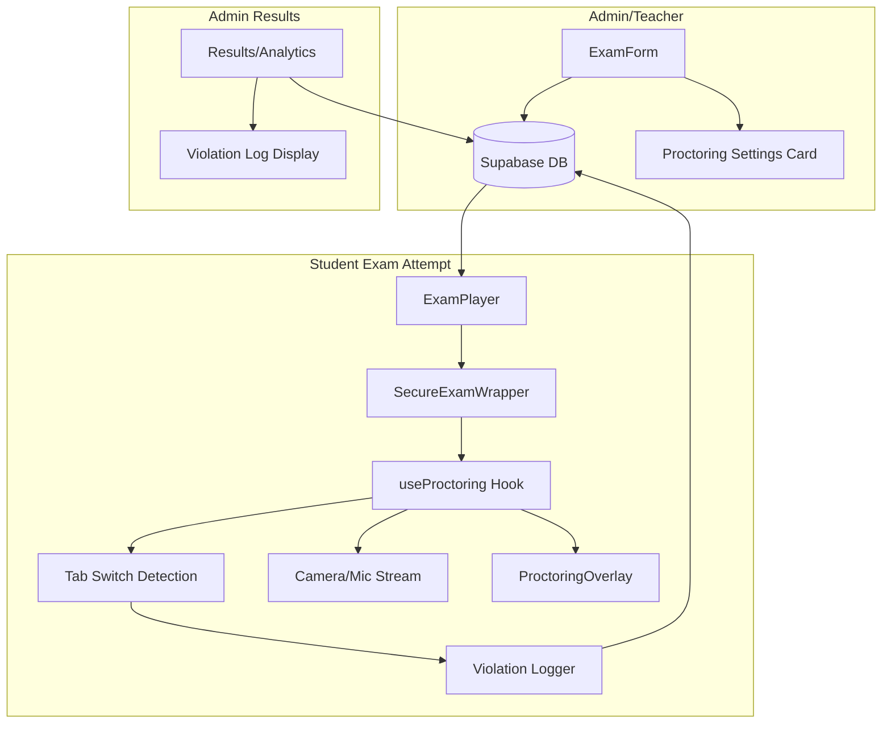
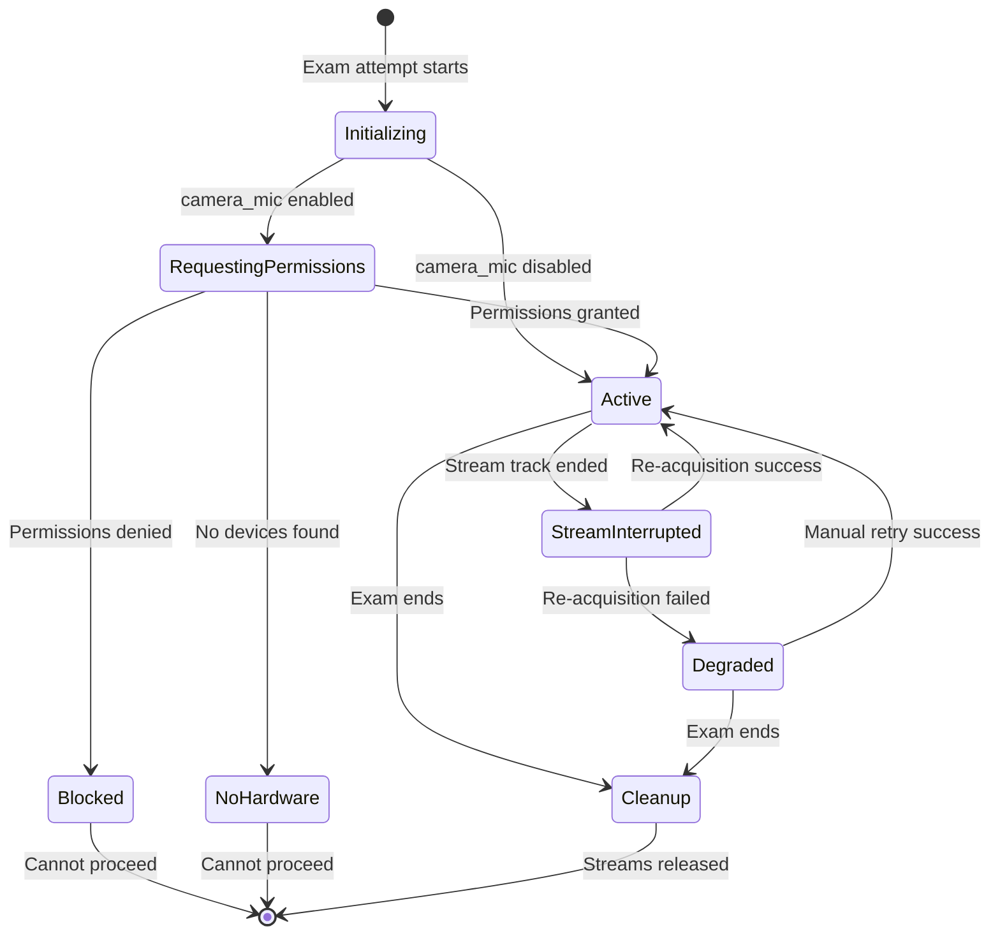

# Design Document: Exam Proctoring

## Overview

This feature adds configurable proctoring capabilities to the EliteClass MCQ exam system. The proctoring system operates entirely client-side as a deterrent mechanism — no audio/video is recorded or transmitted server-side. It integrates with the existing `SecureExamWrapper` and `useTabSwitchDetection` infrastructure, extending them with per-exam configuration, camera/mic activation, a fake proctoring overlay, and detailed violation logging.

The system is designed around three independent, composable proctoring features that admins/teachers can toggle per exam:
1. **Tab Switch Detection** — monitors and logs visibility/focus changes
2. **Camera/Mic Activation** — requests media streams as a deterrent (no recording)
3. **Deterrent UI** — displays a fake "recording active" overlay with camera preview

## Architecture



### Key Design Decisions

1. **Single `useProctoring` hook** — Encapsulates all proctoring logic (camera/mic, deterrent state, tab detection coordination) in one composable hook rather than scattering logic across components. This keeps the ExamPlayer integration minimal.

2. **No server-side recording** — Camera/mic streams are only used locally for the deterrent UI preview. No `MediaRecorder` is instantiated, no data is uploaded. This simplifies infrastructure and avoids privacy/storage concerns.

3. **Extend existing tables** — Add columns to `exams` table rather than a separate proctoring config table. The settings are tightly coupled to exams and always loaded together.

4. **Separate violations table for proctoring** — Use the existing `exam_violations` table which already has the right structure (attempt_id, violation_type, violation_data JSONB, timestamp).

5. **Composable feature flags** — Each proctoring feature is independently toggleable. The deterrent UI adapts its display based on which other features are active (e.g., shows camera preview only when camera is also enabled).

## Components and Interfaces

### Database Layer

**Modified Table: `public.exams`** — Add 3 boolean columns:

```sql
ALTER TABLE public.exams
  ADD COLUMN enable_tab_detection BOOLEAN NOT NULL DEFAULT FALSE,
  ADD COLUMN enable_camera_mic BOOLEAN NOT NULL DEFAULT FALSE,
  ADD COLUMN enable_deterrent_ui BOOLEAN NOT NULL DEFAULT FALSE;
```

**Existing Table: `public.exam_violations`** — Already supports the needed structure:
- `attempt_id` (UUID, FK to exam_attempts)
- `violation_type` (TEXT) — values: `tab_switch`, `window_blur`, `camera_interrupted`, `proctoring_interruption`
- `violation_data` (JSONB) — stores `{ source: 'proctoring', recordedAt: string, details?: string }`
- `timestamp` (TIMESTAMPTZ)

### Frontend Components

#### `useProctoring` Hook

```typescript
interface UseProctoringOptions {
  enabled: boolean;
  enableTabDetection: boolean;
  enableCameraMic: boolean;
  enableDeterrentUi: boolean;
  attemptId: string;
  onViolation?: (type: string) => void;
}

interface UseProctoringReturn {
  // Camera/Mic state
  cameraStream: MediaStream | null;
  isCameraActive: boolean;
  isMicActive: boolean;
  cameraError: string | null;
  
  // Proctoring state
  isProctoring: boolean;
  showBlockingOverlay: boolean;
  
  // Actions
  requestPermissions: () => Promise<void>;
  stopStreams: () => void;
  retryCamera: () => Promise<void>;
}
```

**Location:** `src/modules/exams/hooks/useProctoring.ts`

#### `ProctoringOverlay` Component

```typescript
interface ProctoringOverlayProps {
  cameraStream: MediaStream | null;
  showCameraPreview: boolean;  // true when deterrent_ui AND camera_mic AND stream active
  showRecordingIndicator: boolean;  // true when deterrent_ui is enabled
}
```

**Location:** `src/modules/exams/components/student/ProctoringOverlay.tsx`

Renders:
- A small (160×120px) camera preview in the top-right corner using a `<video>` element with `srcObject`
- A pulsing red dot with "Proctoring Active" text
- Positioned with `fixed` positioning, `z-index` below modals but above content

#### `ProctoringSettingsCard` Component

```typescript
interface ProctoringSettingsCardProps {
  form: UseFormReturn<ExamFormData>;
}
```

**Location:** `src/modules/exams/components/admin/ProctoringSettingsCard.tsx`

Renders a Card with 3 Switch toggles matching the existing ExamForm pattern (border, label, description, switch).

#### `ProctoringStatusBadges` Component

```typescript
interface ProctoringStatusBadgesProps {
  enableTabDetection: boolean;
  enableCameraMic: boolean;
  enableDeterrentUi: boolean;
}
```

**Location:** `src/modules/exams/components/admin/ProctoringStatusBadges.tsx`

Renders small badges/icons indicating active proctoring features.

#### `ViolationLog` Component

```typescript
interface ViolationLogProps {
  attemptId: string;
  violations: Array<{
    id: string;
    violation_type: string;
    violation_data: Record<string, unknown>;
    timestamp: string;
  }>;
}
```

**Location:** `src/modules/exams/components/admin/ViolationLog.tsx`

Displays a timeline/table of violations with timestamps and types.

### Service Layer

**Extended:** `src/modules/exams/services/exam.service.ts`

New functions:
- `getViolationLog(attemptId: string)` — fetches violations for an attempt
- `recordProctoringEvent(attemptId: string, eventType: string, data: object)` — records proctoring-specific events (interruptions, re-acquisitions)

### Schema Updates

**Extended:** `src/modules/exams/validations/exam.schema.ts`

```typescript
// Add to examSchema
enable_tab_detection: z.boolean().default(false),
enable_camera_mic: z.boolean().default(false),
enable_deterrent_ui: z.boolean().default(false),
```

## Data Models

### Proctoring Settings (stored in `exams` table)

| Field | Type | Default | Description |
|-------|------|---------|-------------|
| `enable_tab_detection` | BOOLEAN | false | Enable tab switch monitoring and logging |
| `enable_camera_mic` | BOOLEAN | false | Request camera/mic access as deterrent |
| `enable_deterrent_ui` | BOOLEAN | false | Show fake recording overlay |

### Violation Record (existing `exam_violations` table)

| Field | Type | Description |
|-------|------|-------------|
| `id` | UUID | Primary key |
| `attempt_id` | UUID | FK to exam_attempts |
| `violation_type` | TEXT | `tab_switch`, `window_blur`, `camera_interrupted`, `proctoring_interruption` |
| `violation_data` | JSONB | `{ source, recordedAt, details }` |
| `timestamp` | TIMESTAMPTZ | Server timestamp |

### Proctoring State Machine (client-side)



## Correctness Properties

*A property is a characteristic or behavior that should hold true across all valid executions of a system — essentially, a formal statement about what the system should do. Properties serve as the bridge between human-readable specifications and machine-verifiable correctness guarantees.*

### Property 1: Proctoring settings round-trip persistence

*For any* valid combination of proctoring boolean settings (enable_tab_detection, enable_camera_mic, enable_deterrent_ui), saving the exam and then loading it should produce the same proctoring settings values.

**Validates: Requirements 1.2**

### Property 2: Tab detection monitoring state matches configuration

*For any* exam configuration, the tab switch detector's active monitoring state should equal the value of `enable_tab_detection` — active when true, inactive when false.

**Validates: Requirements 2.1, 2.3**

### Property 3: Violation record structure completeness

*For any* recorded violation event, the persisted record should contain a non-null attempt_id, a non-empty violation_type, and a valid timestamp.

**Validates: Requirements 2.2**

### Property 4: Violation count invariant

*For any* sequence of N tab-switch violation events on an attempt with initial violation count C, the resulting violation count should equal C + N.

**Validates: Requirements 2.5**

### Property 5: No media data transmission

*For any* state where camera/microphone streams are active during a proctored exam, no MediaRecorder should be instantiated and no network requests should be made containing media data.

**Validates: Requirements 3.4**

### Property 6: Stream cleanup on exam end

*For any* exam end scenario (manual submission, auto-submission, time expiry), all active MediaStream tracks should be stopped and the stream references released.

**Validates: Requirements 3.5**

### Property 7: Camera preview conditional visibility

*For any* combination of (enable_deterrent_ui, enable_camera_mic, stream_active), the camera feed preview should be visible if and only if all three conditions are true.

**Validates: Requirements 4.5, 4.6**

### Property 8: Violation display completeness

*For any* attempt with a set of recorded violations, the violation log display should show every violation with its timestamp, and the total count displayed should equal the number of violation records.

**Validates: Requirements 5.2, 5.3**

### Property 9: Proctoring re-initialization on resume

*For any* exam proctoring configuration, when a student resumes an attempt (page refresh), the proctoring system should re-initialize to the same active state as determined by the exam's stored settings.

**Validates: Requirements 6.3**

### Property 10: Hardware interruptions excluded from violation count

*For any* media stream interruption caused by hardware failure (track ended event), the tab-switch violation count should not increase as a result of that event.

**Validates: Requirements 6.4**

## Error Handling

| Scenario | Handling |
|----------|----------|
| Camera/mic permission denied | Show blocking overlay with explanation; prevent exam start |
| No camera/mic hardware detected | Show informational message; prevent exam start |
| Stream interrupted mid-exam | Show warning, attempt re-acquisition; if fails, log event and continue without camera |
| Page Visibility API unsupported | Fall back to focus/blur event listeners |
| Violation recording fails (network) | Retry with exponential backoff; show toast error if persistent |
| Supabase RLS denies write | Log client-side; don't block exam flow |
| Multiple rapid violations | Debounce at 1000ms to prevent duplicate records |

## Testing Strategy

### Property-Based Tests

The feature contains logic suitable for property-based testing, particularly around:
- Configuration persistence (round-trip)
- State machine transitions (monitoring state from config)
- Violation counting invariants
- Conditional rendering logic

**Library:** [fast-check](https://github.com/dubzzz/fast-check) (TypeScript PBT library)
**Configuration:** Minimum 100 iterations per property test
**Tag format:** `Feature: exam-proctoring, Property {number}: {property_text}`

### Unit Tests (Example-Based)

- ExamForm renders proctoring settings section with 3 toggles
- Default values are all false for new exams
- Published exams allow proctoring setting changes
- Permission denied shows blocking overlay
- Deterrent UI renders recording indicator when enabled
- Deterrent UI hides when disabled
- ProctoringStatusBadges renders correct badges per config

### Integration Tests

- Save exam with proctoring settings → load → verify settings persisted
- Start attempt with proctoring enabled → verify hook initializes correctly
- Tab switch with detection enabled → verify violation recorded in DB
- Exam submission → verify streams cleaned up

### Edge Case Tests

- Browser without Page Visibility API → fallback to blur/focus
- Device without camera/mic → blocking message
- Stream interrupted → warning + re-acquisition attempt
- Failed re-acquisition → graceful degradation
