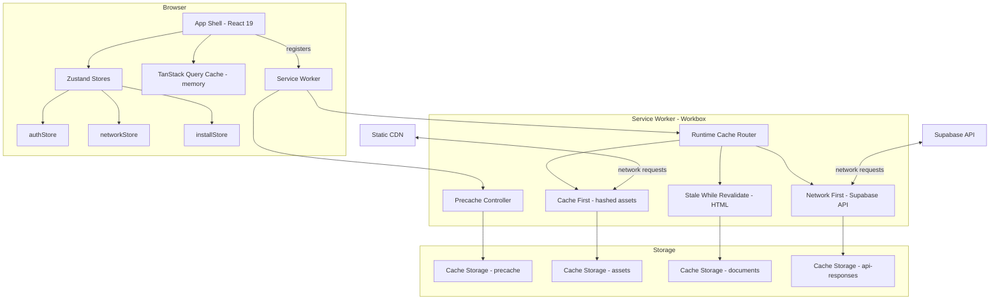

# Design Document: PWA Offline Support

## Overview

This design adds Progressive Web App capabilities to the EduOS platform, enabling installability, offline asset/data caching, a custom install prompt, and network status awareness. The implementation layers a Workbox-powered service worker (generated via `vite-plugin-pwa` in `injectManifest` mode) on top of the existing TanStack Query caching, creating a two-tier offline strategy: in-memory query cache for the current session and persistent Cache Storage for cross-session durability.

Key design decisions:
- **`injectManifest` mode** — gives full control over routing and caching strategies; the build injects the precache manifest into a hand-written service worker source file.
- **Network-First for API, Cache-First for hashed assets** — balances freshness for dynamic data with instant loads for static bundles.
- **Zustand store for network/install state** — keeps UI reactive without prop drilling; persisted install-dismissal cooldown via localStorage.
- **No SSR interference** — service worker registration is gated behind `typeof window !== 'undefined'` and only runs in production.

## Architecture



## Components and Interfaces

### 1. Web App Manifest (`public/manifest.webmanifest`)

Static JSON file referenced by `<link rel="manifest">` in the HTML head. Declares app metadata for installability.

```typescript
interface WebAppManifest {
  name: string;              // "EduOS - EliteClass"
  short_name: string;        // "EduOS"
  description: string;
  start_url: string;         // "/"
  display: "standalone";
  theme_color: string;       // matches Tailwind primary
  background_color: string;
  icons: ManifestIcon[];
}

interface ManifestIcon {
  src: string;
  sizes: string;       // "192x192" | "512x512"
  type: "image/png";
  purpose?: "any" | "maskable" | "any maskable";
}
```

### 2. Service Worker Source (`src/sw.ts`)

Hand-written Workbox service worker compiled by `vite-plugin-pwa` in `injectManifest` mode. Defines caching strategies and lifecycle handlers.

```typescript
// src/sw.ts - conceptual interface
interface ServiceWorkerConfig {
  precacheEntries: PrecacheEntry[];  // injected by vite-plugin-pwa at build time
  apiCacheConfig: {
    cacheName: "eduos-api-v1";
    maxEntries: 100;
    maxAgeSeconds: 86400;          // 24 hours
    networkTimeoutSeconds: 3;
    maxSizeBytes: 50 * 1024 * 1024; // 50 MB
  };
  staticCacheConfig: {
    cacheName: "eduos-static-v1";
    strategy: "CacheFirst";
  };
  documentCacheConfig: {
    cacheName: "eduos-documents-v1";
    strategy: "StaleWhileRevalidate";
  };
}
```

### 3. PWA Vite Plugin Configuration

Extension to `vite.config.ts` adding `vite-plugin-pwa` with `injectManifest` strategy.

```typescript
// Addition to vite.config.ts plugins array
interface PWAPluginConfig {
  strategies: "injectManifest";
  srcDir: "src";
  filename: "sw.ts";
  registerType: "prompt";       // user decides when to update
  injectRegister: false;        // we register manually
  manifest: false;              // we provide our own manifest file
  devOptions: { enabled: false }; // SW only in production
}
```

### 4. Network Status Store (`src/store/networkStore.ts`)

Zustand store tracking online/offline state and exposing it reactively to UI components.

```typescript
interface NetworkState {
  isOnline: boolean;
  lastOnlineAt: number | null;     // timestamp
  setOnline: (online: boolean) => void;
  initialize: () => void;          // attaches event listeners
  cleanup: () => void;             // removes event listeners
}
```

### 5. Install Prompt Store (`src/store/installStore.ts`)

Zustand store managing the `beforeinstallprompt` event lifecycle and dismissal cooldown.

```typescript
interface InstallState {
  canInstall: boolean;
  isInstalled: boolean;
  isDismissed: boolean;
  deferredPrompt: BeforeInstallPromptEvent | null;
  setDeferredPrompt: (event: BeforeInstallPromptEvent | null) => void;
  triggerInstall: () => Promise<void>;
  dismiss: () => void;             // sets 7-day cooldown in localStorage
  shouldShowBanner: () => boolean; // checks cooldown + installed state
  initialize: () => void;
  cleanup: () => void;
}

interface BeforeInstallPromptEvent extends Event {
  prompt: () => Promise<void>;
  userChoice: Promise<{ outcome: "accepted" | "dismissed" }>;
}
```

### 6. SW Registration Module (`src/lib/sw-register.ts`)

Client-side utility that registers the service worker and handles update notifications.

```typescript
interface SWRegistration {
  register: () => Promise<ServiceWorkerRegistration | null>;
  onUpdateAvailable: (callback: () => void) => void;
}
```

### 7. UI Components

| Component | Location | Purpose |
|-----------|----------|---------|
| `OfflineIndicator` | `src/components/pwa/OfflineIndicator.tsx` | Persistent banner when offline |
| `InstallBanner` | `src/components/pwa/InstallBanner.tsx` | Dismissible install prompt |
| `UpdatePrompt` | `src/components/pwa/UpdatePrompt.tsx` | Toast when new SW version ready |
| `PWAProvider` | `src/components/pwa/PWAProvider.tsx` | Initializes stores + SW registration |

## Data Models

### Cache Storage Buckets

| Cache Name | Strategy | Content | Limits |
|-----------|----------|---------|--------|
| `eduos-precache-v1` | Precache (build-time) | App shell HTML, CSS, JS bundles | All build assets |
| `eduos-static-v1` | Cache First | Hashed static assets (images, fonts) | Unlimited (evicted by hash change) |
| `eduos-documents-v1` | Stale While Revalidate | Root HTML document | 1 entry |
| `eduos-api-v1` | Network First (3s timeout) | Supabase GET responses | 100 entries, 24h TTL, 50 MB max |

### URL Matching Patterns

```typescript
// Supabase API pattern - matches *.supabase.co/rest/v1/*
const SUPABASE_API_PATTERN = /^https:\/\/[a-z0-9]+\.supabase\.co\/rest\/v1\/.*/;

// Hashed static assets - files with content hash in name
const HASHED_ASSET_PATTERN = /\/assets\/.*\.[a-f0-9]{8}\.(js|css|woff2?|png|jpg|svg)$/;
```

### Install Prompt Cooldown (localStorage)

```typescript
interface InstallDismissalRecord {
  key: "eduos-install-dismissed";
  value: string;  // ISO 8601 timestamp of dismissal
  cooldownDays: 7;
}
```

### Service Worker Version Update Message

```typescript
interface SWMessage {
  type: "SW_UPDATE_AVAILABLE" | "SW_ACTIVATED" | "CACHE_CLEARED";
  payload?: {
    version?: string;
  };
}
```

## Correctness Properties

*A property is a characteristic or behavior that should hold true across all valid executions of a system — essentially, a formal statement about what the system should do. Properties serve as the bridge between human-readable specifications and machine-verifiable correctness guarantees.*

### Property 1: Hashed asset URL matching

*For any* URL with a content hash segment matching the pattern `/assets/*.[8-hex-chars].(js|css|woff2|png|jpg|svg)`, the service worker route matcher SHALL classify it for Cache First handling, and for any URL without such a hash, it SHALL NOT match the hashed asset pattern.

**Validates: Requirements 3.2**

### Property 2: Supabase API URL matching

*For any* URL matching `https://{project-id}.supabase.co/rest/v1/{table}*` where project-id is alphanumeric, the service worker route matcher SHALL classify it for Network First handling, and for any URL not matching this pattern, it SHALL NOT be routed to the API cache.

**Validates: Requirements 4.1**

### Property 3: API cache entry count limit (LRU)

*For any* sequence of API cache insertions exceeding 100 entries, the cache SHALL contain at most 100 entries, and the evicted entries SHALL be those least recently used.

**Validates: Requirements 4.4**

### Property 4: API cache time-based expiration

*For any* cached API response with an insertion timestamp older than 24 hours relative to the current time, the cache SHALL NOT serve that entry and SHALL mark it for cleanup.

**Validates: Requirements 4.5**

### Property 5: Online-only features disabled when offline

*For any* feature in the set of online-only actions (attendance marking, exam taking, form submissions, chat), when the network state is offline, the corresponding UI trigger SHALL be disabled.

**Validates: Requirements 5.4**

### Property 6: Install banner 7-day cooldown

*For any* dismissal timestamp and any current timestamp within 7 days of that dismissal, `shouldShowBanner()` SHALL return false. For any current timestamp more than 7 days after dismissal, `shouldShowBanner()` SHALL return true (assuming the app is not already installed).

**Validates: Requirements 6.3**

### Property 7: API cache storage size limit

*For any* collection of cached API responses whose total size exceeds 50 MB, the cache eviction process SHALL remove oldest entries until total size is at or below 50 MB.

**Validates: Requirements 8.2, 8.3**

## Error Handling

| Scenario | Handling Strategy |
|----------|------------------|
| Service worker registration fails | Log error to console, continue without offline support. App functions normally as a standard web app. |
| Cache Storage quota exceeded (browser limit) | Catch `QuotaExceededError`, evict oldest API cache entries, retry write. If still fails, skip caching for that response. |
| Service worker fetch handler throws | Fall through to browser's default fetch behavior (network request proceeds normally). |
| Corrupted cache entry (invalid Response) | Delete the corrupted entry, fetch fresh from network. Log warning. |
| `beforeinstallprompt` never fires | `canInstall` remains false, Install Banner never shows. No error state. |
| localStorage unavailable (private browsing) | Catch storage errors in install cooldown logic, default to showing banner (no cooldown). |
| Network status detection inaccurate (`navigator.onLine` false positive) | Use both `navigator.onLine` AND event listeners. Network First strategy's 3s timeout acts as a secondary offline detection. |
| Stale cache served for API data | TanStack Query's `refetchOnReconnect: true` (already configured) will refresh data when connectivity returns. |

## Testing Strategy

### Unit Tests (Example-Based)

Unit tests cover specific scenarios, edge cases, and integration points:

- **Manifest validation**: Verify `manifest.webmanifest` contains all required fields (Req 1.1–1.4)
- **SW registration**: Mock `navigator.serviceWorker`, verify register() called in production (Req 2.1)
- **SW update notification**: Mock waiting SW, verify update UI triggers (Req 2.3)
- **Registration failure**: Verify graceful degradation when register() rejects (Req 2.4)
- **Offline page rendering**: Verify dashboard/courses/schedule render with cached data (Req 5.1–5.3)
- **Offline action toast**: Trigger online-only action while offline, verify toast (Req 5.5)
- **Install prompt lifecycle**: Fire `beforeinstallprompt`, verify banner; click install, verify `prompt()` (Req 6.1–6.5)
- **Network indicator**: Dispatch online/offline events, verify indicator state (Req 7.1–7.3)
- **Manual cache clear**: Verify settings button triggers `caches.delete()` (Req 8.4)

### Property-Based Tests

Property tests verify universal properties across generated inputs using **fast-check** (TypeScript PBT library):

| Property | Generator Strategy | Minimum Iterations |
|----------|-------------------|-------------------|
| 1: Hashed asset URL matching | Generate random filenames with/without valid hashes, various extensions | 100 |
| 2: Supabase API URL matching | Generate random URLs with/without valid supabase.co domain patterns | 100 |
| 3: LRU cache count limit | Generate sequences of 50–200 cache operations (insert/access) | 100 |
| 4: Cache time expiration | Generate entries with random timestamps relative to "now" | 100 |
| 5: Online-only features disabled | Generate random combinations of online-only feature flags and network states | 100 |
| 6: Install cooldown | Generate random dismissal timestamps and current timestamps | 100 |
| 7: Cache storage size limit | Generate collections of responses with random sizes (1KB–5MB each) | 100 |

**Tag format for property tests**: `Feature: pwa-offline-support, Property {N}: {title}`

### Integration Tests

Integration tests verify end-to-end behavior with actual (or mocked) browser APIs:

- SW install event precaches all manifest entries
- SW activate event cleans up old cache versions
- Full offline flow: load page → go offline → navigate → verify cached data served
- SW update flow: new SW detected → user prompted → skipWaiting → new version activates

### Test Framework

- **Unit/Property tests**: Vitest + fast-check
- **Integration tests**: Vitest with MSW (Mock Service Worker) for network mocking
- **E2E tests** (manual/optional): Playwright with `--offline` flag for full browser PWA testing

